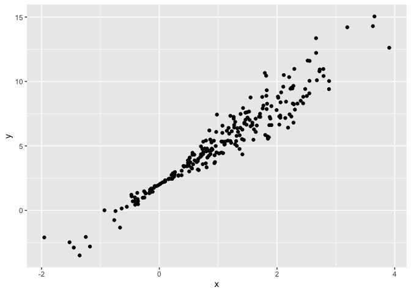

linear_models
================
Anyu Zhu
11/16/2021

``` r
library(tidyverse)
```

    ## ── Attaching packages ─────────────────────────────────────── tidyverse 1.3.1 ──

    ## ✓ ggplot2 3.3.5     ✓ purrr   0.3.4
    ## ✓ tibble  3.1.5     ✓ dplyr   1.0.7
    ## ✓ tidyr   1.1.4     ✓ stringr 1.4.0
    ## ✓ readr   2.0.2     ✓ forcats 0.5.1

    ## ── Conflicts ────────────────────────────────────────── tidyverse_conflicts() ──
    ## x dplyr::filter() masks stats::filter()
    ## x dplyr::lag()    masks stats::lag()

``` r
library(p8105.datasets)
library(modelr)

set.seed(1)
```

Load NYC airbnb data

``` r
data("nyc_airbnb")

nyc_airbnb = 
  nyc_airbnb %>% 
  mutate(stars = review_scores_location / 2) %>% 
  rename(
    borough = neighbourhood_group
  ) %>% 
  filter(borough != "Staten Island") %>% 
  select(price, stars, borough, neighbourhood, room_type)
```

Visualizations

``` r
nyc_airbnb %>% 
  ggplot(aes(x = stars, y = price)) +
  geom_point()
```

    ## Warning: Removed 9962 rows containing missing values (geom_point).

<!-- -->

## Fit a linear model

``` r
fit = lm(price ~ stars + borough, data = nyc_airbnb)
fit
```

    ## 
    ## Call:
    ## lm(formula = price ~ stars + borough, data = nyc_airbnb)
    ## 
    ## Coefficients:
    ##      (Intercept)             stars   boroughBrooklyn  boroughManhattan  
    ##           -70.41             31.99             40.50             90.25  
    ##    boroughQueens  
    ##            13.21

``` r
summary(fit)
```

    ## 
    ## Call:
    ## lm(formula = price ~ stars + borough, data = nyc_airbnb)
    ## 
    ## Residuals:
    ##    Min     1Q Median     3Q    Max 
    ## -169.8  -64.0  -29.0   20.2 9870.0 
    ## 
    ## Coefficients:
    ##                  Estimate Std. Error t value Pr(>|t|)    
    ## (Intercept)       -70.414     14.021  -5.022 5.14e-07 ***
    ## stars              31.990      2.527  12.657  < 2e-16 ***
    ## boroughBrooklyn    40.500      8.559   4.732 2.23e-06 ***
    ## boroughManhattan   90.254      8.567  10.534  < 2e-16 ***
    ## boroughQueens      13.206      9.065   1.457    0.145    
    ## ---
    ## Signif. codes:  0 '***' 0.001 '**' 0.01 '*' 0.05 '.' 0.1 ' ' 1
    ## 
    ## Residual standard error: 181.5 on 30525 degrees of freedom
    ##   (9962 observations deleted due to missingness)
    ## Multiple R-squared:  0.03423,    Adjusted R-squared:  0.03411 
    ## F-statistic: 270.5 on 4 and 30525 DF,  p-value: < 2.2e-16

``` r
fit %>% broom::tidy()
```

    ## # A tibble: 5 × 5
    ##   term             estimate std.error statistic  p.value
    ##   <chr>               <dbl>     <dbl>     <dbl>    <dbl>
    ## 1 (Intercept)         -70.4     14.0      -5.02 5.14e- 7
    ## 2 stars                32.0      2.53     12.7  1.27e-36
    ## 3 boroughBrooklyn      40.5      8.56      4.73 2.23e- 6
    ## 4 boroughManhattan     90.3      8.57     10.5  6.64e-26
    ## 5 boroughQueens        13.2      9.06      1.46 1.45e- 1

``` r
fit %>% 
  broom :: tidy() %>% 
  mutate(term = str_replace(term, "borough", "Borough: ")) %>% 
  select(term, estimate, p.value) %>% 
  knitr::kable(digits = 3)
```

| term               | estimate | p.value |
|:-------------------|---------:|--------:|
| (Intercept)        |  -70.414 |   0.000 |
| stars              |   31.990 |   0.000 |
| Borough: Brooklyn  |   40.500 |   0.000 |
| Borough: Manhattan |   90.254 |   0.000 |
| Borough: Queens    |   13.206 |   0.145 |

## Diagnostic

``` r
modelr::add_residuals(nyc_airbnb, fit) %>% 
  ggplot(aes(x = resid)) +
  geom_density() +
  xlim(-200, 200)
```

    ## Warning: Removed 11208 rows containing non-finite values (stat_density).

<!-- -->

## Interactions, nesting

``` r
fit = lm(price ~ stars * borough + room_type * borough, data = nyc_airbnb)

broom::tidy(fit)
```

    ## # A tibble: 16 × 5
    ##    term                                   estimate std.error statistic   p.value
    ##    <chr>                                     <dbl>     <dbl>     <dbl>     <dbl>
    ##  1 (Intercept)                               90.1       75.4    1.19   0.232    
    ##  2 stars                                      4.45      16.6    0.267  0.789    
    ##  3 boroughBrooklyn                          -20.4       77.1   -0.265  0.791    
    ##  4 boroughManhattan                           5.63      77.8    0.0723 0.942    
    ##  5 boroughQueens                              1.51      83.5    0.0181 0.986    
    ##  6 room_typePrivate room                    -52.9       17.8   -2.98   0.00288  
    ##  7 room_typeShared room                     -70.5       41.6   -1.70   0.0896   
    ##  8 stars:boroughBrooklyn                     16.5       17.0    0.973  0.331    
    ##  9 stars:boroughManhattan                    22.7       17.1    1.33   0.185    
    ## 10 stars:boroughQueens                        5.21      18.3    0.285  0.776    
    ## 11 boroughBrooklyn:room_typePrivate room    -39.3       18.0   -2.18   0.0292   
    ## 12 boroughManhattan:room_typePrivate room   -71.3       18.0   -3.96   0.0000754
    ## 13 boroughQueens:room_typePrivate room      -16.3       19.0   -0.859  0.390    
    ## 14 boroughBrooklyn:room_typeShared room     -35.3       42.9   -0.822  0.411    
    ## 15 boroughManhattan:room_typeShared room    -83.1       42.5   -1.96   0.0503   
    ## 16 boroughQueens:room_typeShared room       -24.4       44.4   -0.550  0.582

``` r
nyc_airbnb %>% 
  relocate(borough) %>% 
  nest(data = price:room_type) %>% 
  mutate(
    lm_fits = map(.x = data, ~lm(price ~ stars + room_type, data = .x)),
    lm_results = map(lm_fits, broom::tidy)
  ) %>% 
  select(borough, lm_results) %>% 
  unnest(lm_results) %>% 
  filter(term == "stars")
```

    ## # A tibble: 4 × 6
    ##   borough   term  estimate std.error statistic  p.value
    ##   <chr>     <chr>    <dbl>     <dbl>     <dbl>    <dbl>
    ## 1 Bronx     stars     4.45      3.35      1.33 1.85e- 1
    ## 2 Queens    stars     9.65      5.45      1.77 7.65e- 2
    ## 3 Brooklyn  stars    21.0       2.98      7.05 1.90e-12
    ## 4 Manhattan stars    27.1       4.59      5.91 3.45e- 9

neighborhoods in Manhattan

``` r
manhattan_lm_results_df = nyc_airbnb %>% 
  filter(borough == "Manhattan") %>% 
  select(-borough) %>% 
  relocate(neighbourhood) %>% 
  nest(data = price:room_type) %>% 
  mutate(
    lm_fits = map(.x = data, ~lm(price ~ stars + room_type, data = .x)),
    lm_results = map(lm_fits, broom::tidy)
  ) %>% 
  select(neighbourhood, lm_results) %>% 
  unnest(lm_results)

manhattan_lm_results_df %>% 
  filter(term == "stars") %>% 
  ggplot(aes(x = estimate)) +
  geom_density()
```

<!-- -->

``` r
manhattan_lm_results_df %>% 
  filter(str_detect(term, "room_type")) %>% 
  ggplot(aes(x = neighbourhood, y = estimate)) +
  geom_point() +
  facet_grid(~term) +
  theme(axis.text.x = element_text(angle = 90, vjust = 0.5, hjust = 1))
```

<!-- -->

## Logistic Regression

for binary outcome

``` r
nyc_airbnb = nyc_airbnb %>% 
  mutate(
    expensive_apt = as.numeric(price > 500)
  )

logistic_fit = 
  glm(expensive_apt ~ stars + borough,
    data = nyc_airbnb, 
    family = binomial())

logistic_fit %>% 
  broom::tidy() %>% 
  mutate(
    term = str_replace(term, "borough", "Borough: "),
    estimate = exp(estimate)
  ) %>% 
  select(term, OR = estimate, p.value)
```

    ## # A tibble: 5 × 3
    ##   term                     OR    p.value
    ##   <chr>                 <dbl>      <dbl>
    ## 1 (Intercept)        7.52e-10 0.908     
    ## 2 stars              2.15e+ 0 0.00000292
    ## 3 Borough: Brooklyn  2.49e+ 5 0.945     
    ## 4 Borough: Manhattan 8.11e+ 5 0.940     
    ## 5 Borough: Queens    1.15e+ 5 0.949

``` r
nyc_airbnb %>% 
  modelr::add_predictions(logistic_fit) %>% 
  mutate(pred = boot::inv.logit(pred)) # get probabilities of 0 or 1
```

    ## # A tibble: 40,492 × 7
    ##    price stars borough neighbourhood room_type       expensive_apt          pred
    ##    <dbl> <dbl> <chr>   <chr>         <chr>                   <dbl>         <dbl>
    ##  1    99   5   Bronx   City Island   Private room                0  0.0000000343
    ##  2   200  NA   Bronx   City Island   Private room                0 NA           
    ##  3   300  NA   Bronx   City Island   Entire home/apt             0 NA           
    ##  4   125   5   Bronx   City Island   Entire home/apt             0  0.0000000343
    ##  5    69   5   Bronx   City Island   Private room                0  0.0000000343
    ##  6   125   5   Bronx   City Island   Entire home/apt             0  0.0000000343
    ##  7    85   5   Bronx   City Island   Entire home/apt             0  0.0000000343
    ##  8    39   4.5 Bronx   Allerton      Private room                0  0.0000000234
    ##  9    95   5   Bronx   Allerton      Entire home/apt             0  0.0000000343
    ## 10   125   4.5 Bronx   Allerton      Entire home/apt             0  0.0000000234
    ## # … with 40,482 more rows

## Cross Validation

``` r
library(modelr)
library(mgcv)
```

    ## Loading required package: nlme

    ## 
    ## Attaching package: 'nlme'

    ## The following object is masked from 'package:dplyr':
    ## 
    ##     collapse

    ## This is mgcv 1.8-38. For overview type 'help("mgcv-package")'.

``` r
nonlin_df = 
  tibble(
    id = 1:100,
    x = runif(100, 0, 1),
    y = 1 - 10 * (x - .3) ^ 2 + rnorm(100, 0, .3)
  )

nonlin_df %>% 
  ggplot(aes(x = x, y = y)) + 
  geom_point()
```

<!-- -->

Create splits by hand

``` r
train_df = sample_n(nonlin_df, 80)
test_df = anti_join(nonlin_df, train_df, by = "id")

ggplot(train_df, aes(x = x, y = y)) +
  geom_point() + 
  geom_point(data = test_df, color = "red")
```

<!-- -->

fit my models

``` r
linear_mod = lm(y ~x, data = train_df)
smooth_mod = mgcv::gam(y ~ s(x), data = train_df)
wiggly_mod = mgcv::gam(y ~s(x, k = 30), sp = 10e-6, data = train_df)
```

plot the results

``` r
train_df %>% 
  add_predictions(smooth_mod) %>% 
  ggplot(aes(x = x, y = y)) +
  geom_point() +
  geom_line(aes(y = pred))
```

<!-- -->

``` r
train_df %>% 
  add_predictions(wiggly_mod) %>% 
  ggplot(aes(x = x, y = y)) +
  geom_point() +
  geom_line(aes(y = pred))
```

<!-- -->

quantify the results

``` r
rmse(linear_mod, test_df)
```

    ## [1] 0.7052956

``` r
rmse(smooth_mod, test_df)
```

    ## [1] 0.2221774

``` r
rmse(wiggly_mod, test_df)
```

    ## [1] 0.289051

## CV iteratively

``` r
cv_df = 
  crossv_mc(nonlin_df, 100) %>% 
  mutate(
    train = map(train, as_tibble),
    test = map(test, as_tibble)
  )
```

fit some models

``` r
cv_df = cv_df %>% 
  mutate(
    linear_mod = map(.x = train, ~lm(y ~ x, data = .x)),
    smooth_mod = map(.x = train, ~gam(y ~ x, data = .x)),
    wiggly_mod = map(.x = train, ~gam(y ~s(x, k = 30), sp = 10e-6, data = train_df))
  ) %>% 
  mutate(
    rmse_linear = map2_dbl(.x = linear_mod, .y = test,~ rmse(model = .x, data = .y)),
    rmse_smooth = map2_dbl(.x = smooth_mod, .y = test,~ rmse(model = .x, data = .y)),
    rmse_wiggly = map2_dbl(.x = wiggly_mod, .y = test,~ rmse(model = .x, data = .y))
  )
```

look at output

``` r
cv_df %>% 
  select(.id, starts_with("rmse")) %>% 
  pivot_longer(
    rmse_linear:rmse_wiggly,
    names_to = "model",
    values_to = "rmse",
    names_prefix = "rmse_"
  ) %>% 
  ggplot(aes(x = model, y = rmse)) +
  geom_boxplot()
```

<!-- -->

## Child growth data

``` r
child_growth = read_csv("nepalese_children.csv") %>% 
  mutate(
    weight_cp = (weight > 7) * (weight - 7)
  )
```

    ## Rows: 2705 Columns: 5

    ## ── Column specification ────────────────────────────────────────────────────────
    ## Delimiter: ","
    ## dbl (5): age, sex, weight, height, armc

    ## 
    ## ℹ Use `spec()` to retrieve the full column specification for this data.
    ## ℹ Specify the column types or set `show_col_types = FALSE` to quiet this message.

``` r
child_growth %>% 
  ggplot(aes(x = weight, y = armc)) + 
  geom_point(alpha = .2)
```

<!-- -->

Consider a linear model first

``` r
linear_mod = lm(armc ~ weight, data = child_growth)
pwl_mod = lm(armc ~ weight + weight_cp, data = child_growth)
smooth_mod = gam(armc ~ s(weight), data = child_growth)
```

``` r
child_growth %>% 
  add_predictions(pwl_mod) %>% 
  ggplot(aes(x = weight, y = armc)) +
  geom_point(alpha = 0.2) +
  geom_line(aes(y = pred), color = "red")
```

<!-- -->

Use CV to compare models

``` r
cv_df = 
  crossv_mc(child_growth, 100) %>% 
  mutate(
    linear_mod  = map(train, ~lm(armc ~ weight, data = .x)),
    pwl_mod     = map(train, ~lm(armc ~ weight + weight_cp, data = .x)),
    smooth_mod  = map(train, ~gam(armc ~ s(weight), data = as_tibble(.x)))
  ) %>% 
   mutate(
    rmse_linear = map2_dbl(linear_mod, test, ~rmse(model = .x, data = .y)),
    rmse_pwl    = map2_dbl(pwl_mod, test, ~rmse(model = .x, data = .y)),
    rmse_smooth = map2_dbl(smooth_mod, test, ~rmse(model = .x, data = .y)))
```

    ## Warning in predict.gam(model, data): not all required variables have been supplied in  newdata!

    ## Warning in predict.gam(model, data): not all required variables have been supplied in  newdata!

    ## Warning in predict.gam(model, data): not all required variables have been supplied in  newdata!

    ## Warning in predict.gam(model, data): not all required variables have been supplied in  newdata!

    ## Warning in predict.gam(model, data): not all required variables have been supplied in  newdata!

    ## Warning in predict.gam(model, data): not all required variables have been supplied in  newdata!

    ## Warning in predict.gam(model, data): not all required variables have been supplied in  newdata!

    ## Warning in predict.gam(model, data): not all required variables have been supplied in  newdata!

    ## Warning in predict.gam(model, data): not all required variables have been supplied in  newdata!

    ## Warning in predict.gam(model, data): not all required variables have been supplied in  newdata!

    ## Warning in predict.gam(model, data): not all required variables have been supplied in  newdata!

    ## Warning in predict.gam(model, data): not all required variables have been supplied in  newdata!

    ## Warning in predict.gam(model, data): not all required variables have been supplied in  newdata!

    ## Warning in predict.gam(model, data): not all required variables have been supplied in  newdata!

    ## Warning in predict.gam(model, data): not all required variables have been supplied in  newdata!

    ## Warning in predict.gam(model, data): not all required variables have been supplied in  newdata!

    ## Warning in predict.gam(model, data): not all required variables have been supplied in  newdata!

    ## Warning in predict.gam(model, data): not all required variables have been supplied in  newdata!

    ## Warning in predict.gam(model, data): not all required variables have been supplied in  newdata!

    ## Warning in predict.gam(model, data): not all required variables have been supplied in  newdata!

    ## Warning in predict.gam(model, data): not all required variables have been supplied in  newdata!

    ## Warning in predict.gam(model, data): not all required variables have been supplied in  newdata!

    ## Warning in predict.gam(model, data): not all required variables have been supplied in  newdata!

    ## Warning in predict.gam(model, data): not all required variables have been supplied in  newdata!

    ## Warning in predict.gam(model, data): not all required variables have been supplied in  newdata!

    ## Warning in predict.gam(model, data): not all required variables have been supplied in  newdata!

    ## Warning in predict.gam(model, data): not all required variables have been supplied in  newdata!

    ## Warning in predict.gam(model, data): not all required variables have been supplied in  newdata!

    ## Warning in predict.gam(model, data): not all required variables have been supplied in  newdata!

    ## Warning in predict.gam(model, data): not all required variables have been supplied in  newdata!

    ## Warning in predict.gam(model, data): not all required variables have been supplied in  newdata!

    ## Warning in predict.gam(model, data): not all required variables have been supplied in  newdata!

    ## Warning in predict.gam(model, data): not all required variables have been supplied in  newdata!

    ## Warning in predict.gam(model, data): not all required variables have been supplied in  newdata!

    ## Warning in predict.gam(model, data): not all required variables have been supplied in  newdata!

    ## Warning in predict.gam(model, data): not all required variables have been supplied in  newdata!

    ## Warning in predict.gam(model, data): not all required variables have been supplied in  newdata!

    ## Warning in predict.gam(model, data): not all required variables have been supplied in  newdata!

    ## Warning in predict.gam(model, data): not all required variables have been supplied in  newdata!

    ## Warning in predict.gam(model, data): not all required variables have been supplied in  newdata!

    ## Warning in predict.gam(model, data): not all required variables have been supplied in  newdata!

    ## Warning in predict.gam(model, data): not all required variables have been supplied in  newdata!

    ## Warning in predict.gam(model, data): not all required variables have been supplied in  newdata!

    ## Warning in predict.gam(model, data): not all required variables have been supplied in  newdata!

    ## Warning in predict.gam(model, data): not all required variables have been supplied in  newdata!

    ## Warning in predict.gam(model, data): not all required variables have been supplied in  newdata!

    ## Warning in predict.gam(model, data): not all required variables have been supplied in  newdata!

    ## Warning in predict.gam(model, data): not all required variables have been supplied in  newdata!

    ## Warning in predict.gam(model, data): not all required variables have been supplied in  newdata!

    ## Warning in predict.gam(model, data): not all required variables have been supplied in  newdata!

    ## Warning in predict.gam(model, data): not all required variables have been supplied in  newdata!

    ## Warning in predict.gam(model, data): not all required variables have been supplied in  newdata!

    ## Warning in predict.gam(model, data): not all required variables have been supplied in  newdata!

    ## Warning in predict.gam(model, data): not all required variables have been supplied in  newdata!

    ## Warning in predict.gam(model, data): not all required variables have been supplied in  newdata!

    ## Warning in predict.gam(model, data): not all required variables have been supplied in  newdata!

    ## Warning in predict.gam(model, data): not all required variables have been supplied in  newdata!

    ## Warning in predict.gam(model, data): not all required variables have been supplied in  newdata!

    ## Warning in predict.gam(model, data): not all required variables have been supplied in  newdata!

    ## Warning in predict.gam(model, data): not all required variables have been supplied in  newdata!

    ## Warning in predict.gam(model, data): not all required variables have been supplied in  newdata!

    ## Warning in predict.gam(model, data): not all required variables have been supplied in  newdata!

    ## Warning in predict.gam(model, data): not all required variables have been supplied in  newdata!

    ## Warning in predict.gam(model, data): not all required variables have been supplied in  newdata!

    ## Warning in predict.gam(model, data): not all required variables have been supplied in  newdata!

    ## Warning in predict.gam(model, data): not all required variables have been supplied in  newdata!

    ## Warning in predict.gam(model, data): not all required variables have been supplied in  newdata!

    ## Warning in predict.gam(model, data): not all required variables have been supplied in  newdata!

    ## Warning in predict.gam(model, data): not all required variables have been supplied in  newdata!

    ## Warning in predict.gam(model, data): not all required variables have been supplied in  newdata!

    ## Warning in predict.gam(model, data): not all required variables have been supplied in  newdata!

    ## Warning in predict.gam(model, data): not all required variables have been supplied in  newdata!

    ## Warning in predict.gam(model, data): not all required variables have been supplied in  newdata!

    ## Warning in predict.gam(model, data): not all required variables have been supplied in  newdata!

    ## Warning in predict.gam(model, data): not all required variables have been supplied in  newdata!

    ## Warning in predict.gam(model, data): not all required variables have been supplied in  newdata!

    ## Warning in predict.gam(model, data): not all required variables have been supplied in  newdata!

    ## Warning in predict.gam(model, data): not all required variables have been supplied in  newdata!

    ## Warning in predict.gam(model, data): not all required variables have been supplied in  newdata!

    ## Warning in predict.gam(model, data): not all required variables have been supplied in  newdata!

    ## Warning in predict.gam(model, data): not all required variables have been supplied in  newdata!

    ## Warning in predict.gam(model, data): not all required variables have been supplied in  newdata!

    ## Warning in predict.gam(model, data): not all required variables have been supplied in  newdata!

    ## Warning in predict.gam(model, data): not all required variables have been supplied in  newdata!

    ## Warning in predict.gam(model, data): not all required variables have been supplied in  newdata!

    ## Warning in predict.gam(model, data): not all required variables have been supplied in  newdata!

    ## Warning in predict.gam(model, data): not all required variables have been supplied in  newdata!

    ## Warning in predict.gam(model, data): not all required variables have been supplied in  newdata!

    ## Warning in predict.gam(model, data): not all required variables have been supplied in  newdata!

    ## Warning in predict.gam(model, data): not all required variables have been supplied in  newdata!

    ## Warning in predict.gam(model, data): not all required variables have been supplied in  newdata!

    ## Warning in predict.gam(model, data): not all required variables have been supplied in  newdata!

    ## Warning in predict.gam(model, data): not all required variables have been supplied in  newdata!

    ## Warning in predict.gam(model, data): not all required variables have been supplied in  newdata!

    ## Warning in predict.gam(model, data): not all required variables have been supplied in  newdata!

    ## Warning in predict.gam(model, data): not all required variables have been supplied in  newdata!

    ## Warning in predict.gam(model, data): not all required variables have been supplied in  newdata!

    ## Warning in predict.gam(model, data): not all required variables have been supplied in  newdata!

    ## Warning in predict.gam(model, data): not all required variables have been supplied in  newdata!

    ## Warning in predict.gam(model, data): not all required variables have been supplied in  newdata!

Look at rmse

``` r
cv_df %>% 
  select(starts_with("rmse")) %>% 
  pivot_longer(
    everything(),
    names_to = "model", 
    values_to = "rmse",
    names_prefix = "rmse_") %>% 
  mutate(model = fct_inorder(model)) %>% 
  ggplot(aes(x = model, y = rmse)) + geom_boxplot()
```

<!-- -->

## Bootstrapping

``` r
n_samp = 250

sim_df_const = 
  tibble(
    x = rnorm(n_samp, 1, 1),
    error = rnorm(n_samp, 0, 1),
    y = 2 + 3 * x + error
  )

sim_df_nonconst = sim_df_const %>% 
  mutate(
  error = error * .75 * x,
  y = 2 + 3 * x + error
)

sim_df_const %>% 
  ggplot(aes(x = x, y = y)) +
  geom_point()
```

<!-- -->

``` r
sim_df_nonconst %>% 
  ggplot(aes(x = x, y = y)) +
  geom_point()
```

<!-- -->

``` r
sim_df_const %>% 
  lm(y ~ x, data = .) %>% 
  broom::tidy()
```

    ## # A tibble: 2 × 5
    ##   term        estimate std.error statistic   p.value
    ##   <chr>          <dbl>     <dbl>     <dbl>     <dbl>
    ## 1 (Intercept)     2.11    0.0860      24.5 3.76e- 68
    ## 2 x               3.02    0.0593      51.0 2.12e-133

## try to use bootstrapping

``` r
bootstrap_sample = sim_df_nonconst %>% 
  sample_frac(size = 1, replace = TRUE) %>% 
  arrange(x)

lm(y ~ x, data = bootstrap_sample)
```

    ## 
    ## Call:
    ## lm(formula = y ~ x, data = bootstrap_sample)
    ## 
    ## Coefficients:
    ## (Intercept)            x  
    ##       2.066        3.005

## function

``` r
boot_sample = function(df) {
  sample_frac(df, size = 1, replace = TRUE)
}
```

A tibble to keep track of everything

``` r
boot_strap_df = 
  tibble(
    strap_number = 1:1000,
    strap_sample = rerun(1000, boot_sample(sim_df_nonconst))
  )
```

``` r
boot_strap_results = 
  boot_strap_df %>% 
  mutate(
    models = map(.x = strap_sample, ~lm(y ~ x, data = .x)),
    results = map(models, broom::tidy)
  ) %>% 
  select(strap_number, results) %>% 
  unnest(results)

boot_strap_results %>% 
  ggplot(aes(x = estimate)) +
  geom_histogram() +
  facet_grid(~term, scales = "free")
```

    ## `stat_bin()` using `bins = 30`. Pick better value with `binwidth`.

<!-- -->

``` r
lm(y ~ x, data = sim_df_nonconst) %>% 
  broom::tidy()
```

    ## # A tibble: 2 × 5
    ##   term        estimate std.error statistic   p.value
    ##   <chr>          <dbl>     <dbl>     <dbl>     <dbl>
    ## 1 (Intercept)     2.01    0.0818      24.5 2.58e- 68
    ## 2 x               3.10    0.0563      55.1 4.19e-141

``` r
boot_strap_results %>% 
  group_by(term) %>% 
  summarize(
    se = sd(estimate)
  )
```

    ## # A tibble: 2 × 2
    ##   term            se
    ##   <chr>        <dbl>
    ## 1 (Intercept) 0.0583
    ## 2 x           0.0671

## Use modelr

``` r
sim_df_nonconst %>% 
  bootstrap(n = 1000, id = "strap_number") %>% 
  mutate(
    models = map(.x = strap, ~lm(y ~ x, data = .x)),
    results = map(models, broom::tidy)
  )
```

    ## # A tibble: 1,000 × 4
    ##    strap                strap_number models results         
    ##    <list>               <chr>        <list> <list>          
    ##  1 <resample [250 x 3]> 0001         <lm>   <tibble [2 × 5]>
    ##  2 <resample [250 x 3]> 0002         <lm>   <tibble [2 × 5]>
    ##  3 <resample [250 x 3]> 0003         <lm>   <tibble [2 × 5]>
    ##  4 <resample [250 x 3]> 0004         <lm>   <tibble [2 × 5]>
    ##  5 <resample [250 x 3]> 0005         <lm>   <tibble [2 × 5]>
    ##  6 <resample [250 x 3]> 0006         <lm>   <tibble [2 × 5]>
    ##  7 <resample [250 x 3]> 0007         <lm>   <tibble [2 × 5]>
    ##  8 <resample [250 x 3]> 0008         <lm>   <tibble [2 × 5]>
    ##  9 <resample [250 x 3]> 0009         <lm>   <tibble [2 × 5]>
    ## 10 <resample [250 x 3]> 0010         <lm>   <tibble [2 × 5]>
    ## # … with 990 more rows

``` r
data("nyc_airbnb")
```

``` r
nyc_airbnb = 
  nyc_airbnb %>% 
  mutate(stars = review_scores_location / 2) %>% 
  rename(
    borough = neighbourhood_group) %>% 
  filter(borough != "Staten Island") %>% 
  select(price, stars, borough, room_type)
```

``` r
airbnb_bootstrap_results = nyc_airbnb %>% 
  filter(borough == "Manhattan") %>% 
  bootstrap(n = 1000, id = "strap_number") %>% 
  mutate(
    models = map(.x = strap, ~lm(price ~ stars, data = .x)),
    results = map(models, broom::tidy)
  ) %>% 
  select(strap_number, results) %>% 
  unnest(results)

airbnb_bootstrap_results %>% 
  filter(term == "stars") %>% 
  ggplot(aes(estimate)) +
  geom_density()
```

<!-- -->
